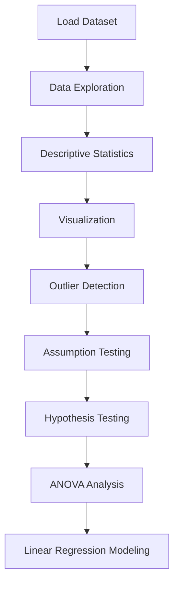

# 📊 Blood Pressure Analysis and Statistical Interpretation Project

<div align="center">

This folder documents a **complete statistical analysis of blood pressure reduction** in response to **drug dose and gender**, using **R programming**, including reproducible workflows, visualizations, and detailed reporting.

</div>

---

## 📘 Project Overview

This project investigates how **dose** and **gender** influence **blood pressure reduction (mmHg)**.
Using **biostatistical methods in R**, the analysis covers the full pipeline from **data exploration** to **statistical modeling and inference**.



---

## 📂 Folder Structure

```
BloodPressure_Statistical_Analysis_Project/
│
├── README.md  
├── BloodPressure_Analysis_Report.md        # Full detailed report
├── ProjectA_BloodPressure_Analysis.Rmd     # R Markdown notebook
├── ProjectA_BloodPressure_Analysis.pdf     # Exported analysis report
└── BloodPressure.RData                    # Dataset (R workspace)
```

---

## 📁 Project Contents

| File / Folder                         | Description                                 | Link                                                 |
| ------------------------------------- | ------------------------------------------- | ---------------------------------------------------- |
| `BloodPressure_Analysis_Report.md`    | Full statistical analysis with explanations | [View Report](BloodPressure_Analysis_Report.md)      |
| `ProjectA_BloodPressure_Analysis.Rmd` | Reproducible R notebook (code + analysis)   | [View Notebook](ProjectA_BloodPressure_Analysis.Rmd) |
| `ProjectA_BloodPressure_Analysis.pdf` | Final formatted analysis output             | [View PDF](ProjectA_BloodPressure_Analysis.pdf)      |
| `BloodPressure.RData`                 | Dataset used in analysis                    | [View Dataset](BloodPressure.RData)                  |

---

## 🔬 Dataset Summary

| Feature        | Description                                 |
| -------------- | ------------------------------------------- |
| Dataset Type   | Clinical / Simulated Biostatistical Dataset |
| Sample Size    | 40 observations                             |
| Variables      | bp.reduction, dose, gender                  |
| Dose Levels    | 0, 2, 5, 10 mg/day                          |
| Platform       | R Programming                               |
| Libraries Used | dplyr, ggplot2, psych, car, Hmisc           |

---

## 📊 Analysis Highlights

* Strong **positive correlation** between dose and blood pressure reduction (**r ≈ 0.86**)
* **Dose** is a highly significant predictor (**p < 0.001**)
* **Gender** is not statistically significant
* ANOVA shows **significant differences across dose groups**
* Linear regression explains **~75% of variance (R² ≈ 0.75)**

---

## 🧠 Analytical Workflow

| Step                   | Method                             |
| ---------------------- | ---------------------------------- |
| Data Exploration       | Structure, summary statistics      |
| Descriptive Statistics | Mean, correlation, distributions   |
| Visualization          | Histograms, boxplots, scatterplots |
| Assumption Testing     | Shapiro–Wilk, Levene’s test        |
| Hypothesis Testing     | t-tests                            |
| Group Comparison       | ANOVA + Tukey HSD                  |
| Modeling               | Linear regression                  |

---

## 📈 Key Results

* Increasing **dose leads to higher BP reduction**
* Regression model:

 BP Reduction = β₀ + β₁(dose) + β₂(gender)

* Example prediction:

  * At **3 mg/day (male)** → **~6.18 mmHg reduction**

---

## 🌟 Relevance to My Field

As an MSc candidate in **Biochemistry & Molecular Biology (Molecular Cancer Biology & Bioinformatics)**, this project provided:

* Practical experience in **biostatistics and quantitative data analysis**
* Strong foundation in **R-based reproducible research workflows**
* Hands-on training in **statistical modeling and hypothesis testing**
* Skills applicable to:

  * Clinical data analysis
  * Omics datasets (RNA-seq, biomarker studies)
  * Translational research

This project strengthens my ability to apply **statistical reasoning in biomedical and cancer research**, especially in **analyzing experimental and patient-derived data**.

---

## 🧠 Skills Acquired

| Category             | Skills                                        |
| -------------------- | --------------------------------------------- |
| Biostatistics        | Hypothesis testing, ANOVA, regression         |
| Data Analysis        | Data exploration, correlation, interpretation |
| Programming          | R, R Markdown                                 |
| Visualization        | ggplot2 plotting                              |
| Reproducibility      | Rmd → PDF workflow                            |
| Scientific Reporting | Structured reports and documentation          |

---

## 🖋️ Author Contributions

**Mohamed H. Hussein**      
M.Sc. Candidate, Biochemistry & Molecular Biology   
Ain Shams University, Egypt   

* Completed the full analysis independently using **R**
* Developed and executed the **entire statistical workflow**
* Created **R Markdown notebook** and exported reproducible PDF
* Wrote a **comprehensive analysis report (.md)**
* Interpreted statistical results and model outputs
* Organized and documented the project for **GitHub reproducibility**


---

## 📝 Citation & Usage

This folder is part of the **R Programming and Statistical Analysis repository** and is fully authored and organized by **Hussein, Mohamed H.**.

**citation:**

Hussein, Mohamed H. (2025). *R-Programming-and-Statistical-Analysis* [Summary, Notes, Assignments, and Project in R Programming]. GitHub repository: [https://github.com/Mohamed-H-Hussein/R-Programming-and-Statistical-Analysis](https://github.com/Mohamed-H-Hussein/R-Programming-and-Statistical-Analysis)

---

## 📜 License
[](https://opensource.org/licenses/MIT)  

This folder is licensed under the MIT License.  
See the full license details: [https://opensource.org/licenses/MIT](https://opensource.org/licenses/MIT)

© 2025 Mohamed H. Hussein. All content is provided "as is" without warranty of any kind.

